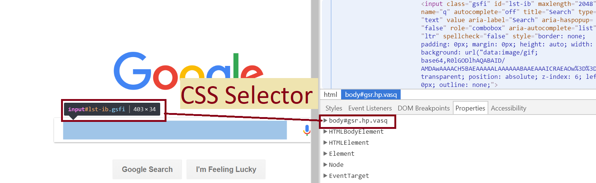

# Selenium "Cheat"/Reference Sheet

## Getting Started

chromedriver.exe does *not* come w/ Selenium; easy to just google and download


```python
from selenium import webdriver

path_to_chromedriver = '../src/chromedriver.exe'
browser = webdriver.Chrome(path_to_chromedriver)
url_requires_http = 'https://www.google.com'
browser.get(url_requires_http)
```


```python
search_bar = browser.find_element_by_css_selector("input#lst-ib.gsfi[title = 'Search']")
search_bar.send_keys('text')
search_bar.submit() 
# or browser.find_element_by_css_selector("input[value='Google Search']").click()
```
## Getting Elements

### CSS Selectors


``` css selector = tag#id.class[attribute=value] ```

### X-Path
X-Path stands for XML Path Language. XPath uses "path-like" syntax to identify and navigate
nodes in an XML document.

#### Difference Between XML and HTML
XML and HTML are both markup languages. The differences are that (1) XML is meant to store data while html was designed to display data with a focus on how data loads and (2) html has predefined tags. 

```python
x_path = .//tag[@attr='value']
x_path = .//tag[attr] means grab any element that has that attribute
```

```python
## /: selects fr the root node ;'/head' does NOT work, '/html/head' works
## .//: select fr current node
abs_path = 'html/head'
relative_path = './/head'
list_of_elems_in_node = browser.find_elements_by_xpath(relative_path)
```

### find_element vs find_elementS


```python
first_elem = browser.find_element_by_xpath(relative_path)
```


```python
divs_elems_in_first_elem = first_elem.find_elements_by_xpath('.//div')
```

## Windows, Tabs, and Frames
```python
from selenium.webdriver.common.keys import Keys
def open_new_tab(anchor_elem):
    anchor_elem.send_keys(Keys.CONTROL + Keys.RETURN)
open_windows_tabs = browser.window_handles    
newest_window_tab = open_windows_tabs[-1]
browser.switch_to_window(newest_window_tab)
```


```python
browser.current_url; browser.page_source; browser.window_handles;
```

## reCaptcha
You can usually successfully check the "I'm not a robot". Idk why it works because Google supposedly checks for mouse movements when you click the checkbox. `pyautogui.locateCenterOnScreen(img_to_find)` is broken.
```
import time; import random
sleep(seconds = randrange(12)); checkbox.click()
```

## Other
If you find a full html doc. between `<iframe>` tags, then you need to run `browser.switch_to.frame(frame_elem)`


```python
def show_attr(elements):
    for e in elements:
        attr = ['class', 'name', 'id', 'title']
        for i, attr in enumerate(attr):
            print(i)
            print(attr, '=', e.get_attribute(attr))
    text_btwn_tags = e.text; print(text_btwn_tags)
```

```
from selenium.webdriver.common.keys import Keys
from selenium.webdriver.support.ui import WebDriverWait
from selenium.webdriver.support import expected_conditions as EC 
from selenium.webdriver.common.by import By
from selenium.common.exceptions import TimeoutException

wait = WebDriverWait(webdriver, time_out_in_seconds) 

try:
    continue_button = wait.until(EC.presence_of_element_located((By.ID, 'continue')))
except TimeoutException:
    pass
```
`By.CSS_SELECTOR`, `By.XPATH`
`EC.element_to_be_clickable`, `EC.visibility_of_element_located`, `EC.alert_is_present`


